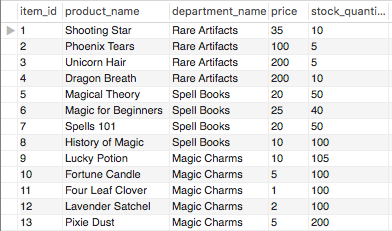

# Bamazon
## Amazon but magical! BAM

### Summary
The magical CLI app version of Amazon. The commands availalble depend on whether the user is a customer, manager, or supervisor. Browse around and bring home the perfect magical item!

### Features
* MySQL Database
* Inquirer
* Node.js

### Demo

#### bamazonCustomer.js
1) After creation of the Bamazon database and products table, this is what the products table looks like.

2) When the user commands to run "node BamazonCustomer.js", this is the view of the products they will be seeing.

3) When the user enters a quantity to purchase that is over the available stock quantity, they get this message, and the products table is not altered at all.

4) The table still looks the same after this.

5) When the user enters a product whose quantity is also available in the stock quantity, the transaction will go through. The stock quantity is updated in the products table, and the user will receive a receipt of the item they purchased.

6) The table will be updated at the ID of the user's chosen product. The stock number will go down by how much quantity the user purchased.

#### bamazonManager.js
1) Still using the same Bamazon products table, user now enters the manager view, and sees the options to view products for sale, view low inventory items, add stock to items, add new product, and log out. The options menu will show up after each function has been completed.

2) When the manager picks to view products for sale, they will see all the product info listed.

3) When the manager picks to view low inventory items, they will see all the products with less than 5 in stock. Because none of the products are less than 5 in stock at the moment, there's nothing in low inventory.

3.5) After testing the other functions below, we come back to low inventory. It turns out a customer purchased several Phoenix Tears, making the inventory lower than 5. The update is shown in the table too.

When the manager goes back to check low inventory, now they will see the Phoenix Tears listed there.

4) When the manager picks to add stock to items, they will have to enter the id of the item they'd like to add stock to, and the quantity of stock they are adding. If added successfully, the manager will see a success message and the table will be updated.

5) When the manager picks to add a new product, they will have to enter the product name, choose a department, add a price, and add stock. The id will auto increment. If added successfully, the manager will see a success message and the table will be updated.

6) Finally, when the manager wants to log out, they will see a log out message.

#### bamazonSupervisor.js
1) While still using the products table, now a departments table is needed to keep track of each department and their overhead costs. After the creation of that table, the supervisor can go to the terminal menu. 

(This table screenshot was taken after the department Potions was added via the add new department option.)

2) The terminal options menu will let the supervisor choose whether to view product sales by department, add a new department, or log out.

2.5) To get the product sales, the bamazonCustomer.js was also updated. A new product_sales column was added to the products table, and whenever the customer chooses to purchase an item, the product sale is updated on the products table. 

3) When the supervisor picks the view product sales department, they will see a table in the terminal with the following information: department id, department name, over head costs, product sales, and total profit. This is created by doing an inner join on the departments and products tables. (Total profit is calculated on the fly and not actually included in either the departments or products tables. Only products that have product sales and total profit greater than 0 are shown.)

    In this table, you only see two departments because the other departments don't have product sales or total profits. When you create a new department it won't be added into this table because that department doesn't exist on the products table until the manager goes back to add a product under that new department.

4) When the supervisor picks the add new department option, they will see prompts that ask them to input a new department name and the over head costs for that department. Department id will auto increment. If successful, the supervisor will see a success message and the table will be updated. 

(In this table, the other departments haven't been inserted yet, so Potions will appear as the first.)

5) When the supervisor wants to log out, they will see a log out message. 

