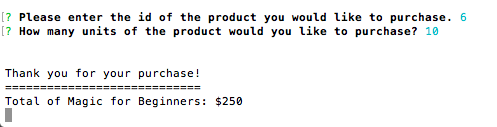
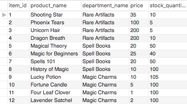

# Bamazon

## bamazonCustomer.js
1) After creation of the Bamazon database and products table, this is what the products table looks like.

2) When the user commands to run "node BamazonCustomer.js", this is the view of the products they will be seeing.

3) When the user enters a quantity to purchase that is over the available stock quantity, they get this message, and the products table is not altered at all.

4) The table still looks the same after this.

5) When the user enters a product whose quantity is also available in the stock quantity, the transaction will go through. The stock quantity is updated in the products table, and the user will receive a receipt of the item they purchased.

6) The table will be updated at the ID of the user's chosen product. The stock number will go down by how much quantity the user purchased.

## bamazonManager.js
1) Still using the same Bamazon products table, user now enters the manager view, and sees the options to view products for sale, view low inventory items, add stock to items, add new product, and log out. The options menu will show up after each function has been completed.

2) When the manager picks to view products for sale, they will see all the product info listed.

3) When the manager picks to view low inventory items, they will see all the products with less than 5 in stock. Because none of the products are less than 5 in stock at the moment, there's nothing in low inventory.

4) When the manager picks to add stock to items, they will have to enter the id of the item they'd like to add stock to, and the quantity of stock they are adding. If added successfully, the manager will see a success message and the table will be updated.

5) When the manager picks to add a new product, they will have to enter the product name, choose a department, add a price, and add stock. The id will auto increment. If added successfully, the manager will see a success message and the table will be updated.

6) Finally, when the manager wants to log out, they will see a log out message.

